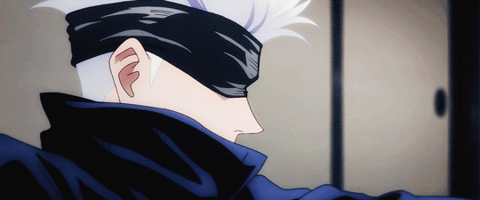

#
# ***Hi!👋🏻 My name is Nasri Zerbeh***
### *I'm a junior backend developer learning about .NET...* 💻
#
### 🚀 ***My most advanced project at the moment is:***
#### • 🎮 [*Adventure_Village_Estadistics*](https://github.com/NasriZerbeh/Adventure_Village_Estadisticas): *An administrative system of a non-real game. It was a project carried out in the 4th semester of my university.*
#
<!--
**NasriZerbeh/NasriZerbeh** is a ✨ _special_ ✨ repository because its `README.md` (this file) appears on your GitHub profile.

Here are some ideas to get you started:

- 🔭 I’m currently working on ...
- 🌱 I’m currently learning ...
- 👯 I’m looking to collaborate on ...
- 🤔 I’m looking for help with ...
- 💬 Ask me about ...
- 📫 How to reach me: ...
- 😄 Pronouns: ...
- ⚡ Fun fact: ...
-->
